  <picture>
    <source media="(prefers-color-scheme: dark)" srcset="images/banner-dark.svg">
    
  </picture>

  
  
  
  
  
  

## 👨‍💻 About Me

- 🚀 Currently Java Developer at **Globant**.
- 💡 Passionate about **Software Architecture**, **DevOps**, and **Data Science**.
- 🌱 Exploring: Quarkus, Kubernetes and AI-assisted development (AI-DLC).
- 🤝 Building **[Chamba Lab](https://chamba-lab.github.io/home/)**, a community-led tech platform for people growing their tech careers.
- 📒 I keep my learning notebooks and experiments separated at **[MeloStudy](https://github.com/MeloStudy)**.

## 🛠️ Tech Stack

  

## ⭐ Spaces & Platforms

| | Space | What it is |
| :---: | :--- | :--- |
| 🌐 | **[Portfolio](https://melodev2111.github.io/portfolio/en/)** | My personal site: backend architecture & cloud work. Astro · React · Tailwind. |
| 🤝 | **[Chamba Lab](https://chamba-lab.github.io/home/)** | Community-led tech platform. Join us on Discord. |
| 📚 | **[MeloStudy](https://github.com/MeloStudy)** | My learning lab: notebooks, certifications and experiments. |

## 🥋 Coding Problem Stats

| [Codewars](https://www.codewars.com/users/MeloDev) | [LeetCode](https://leetcode.com/u/MeloDev2111/) |
| :---: | :---: | 
|  |  |
